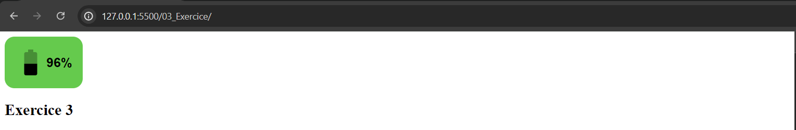

# Exercice 3 - Composant batterie - 5%

Vous devez créer une classe qui affiche le niveau de batterie d'un appareil. Le composant doit afficher dans l'entête une icône de batterie et un texte indiquant le niveau de batterie qui est un nombre entre 0 et 100.

Le composant doit utiliser l'API `Battery Status` pour obtenir le niveau de batterie de l'appareil.

Ressource: [https://developer.mozilla.org/en-US/docs/Web/API/Battery_Status_API](https://developer.mozilla.org/en-US/docs/Web/API/Battery_Status_API)

Le composant doit être réutilisable et doit être capable de changer de couleur en fonction du niveau de batterie. Voici un exemple de ce que le composant doit afficher:

-   Si le niveau de batterie est entre 0 et 20, la couleur doit être rouge.
-   Si le niveau de batterie est entre 21 et 50, la couleur de l'icône et du texte doit être jaune.
-   Si le niveau de batterie est entre 51 et 100, la couleur de l'icône et du texte doit être verte.

Vous devez changer l'icône en fonction du niveau de batterie.

Je vous ai fournis des icônes mais vous pouvez en choisir d'autres ici: [https://www.iconfinder.com/search?q=battery&price=free](https://www.iconfinder.com/search?q=battery&price=free)

**À noter que vous devez tester avec Chrome ou Edge pour que l'API fonctionne. Firefox ne fonctionnera pas**

## Affichage

Pour l'affichage, vous avez le choix d'utiliser les éléments suivants:

-   balise template
-   HTML dans un fichier séparer
-   composant HTML personnalisé

**Vous ne pouvez pas avoir le HTML directement dans le fichier JS.**

## Mise à jour

La classe doit avoir une méthode `miseAJour()` qui met à jour le niveau de batterie dans le composant. Vous devez appeler cette méthode à chaque fois que le niveau de batterie change et changer l'affichage.

## Structure

Le code js et css du composant Batterie doit être dans des fichiers indépendants.

## Programmation orientée objet

La classe doit respectée les principes de la programmation orientée objet. Vous devez encapsuler les variables et les méthodes de la classe lorsque c'est possible.

## Remise

Vous devez utiliser le lien suivant: [https://classroom.github.com/a/4t70Rawg](https://classroom.github.com/a/4t70Rawg) pour créer votre projet.
Vous devez mettre votre projet sur GitHub et le déployer sur `GitHub Pages` pour que je puisse le consulter en ligne avec un cellulaire.

Remettre le lien de votre projet GitHub Pages dans un fichier Readme.md à la racine de votre projet.

**Cet exercice compte pour 5% de la note finale.**
